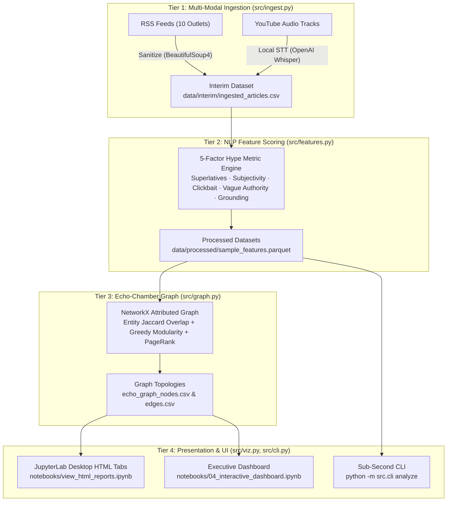
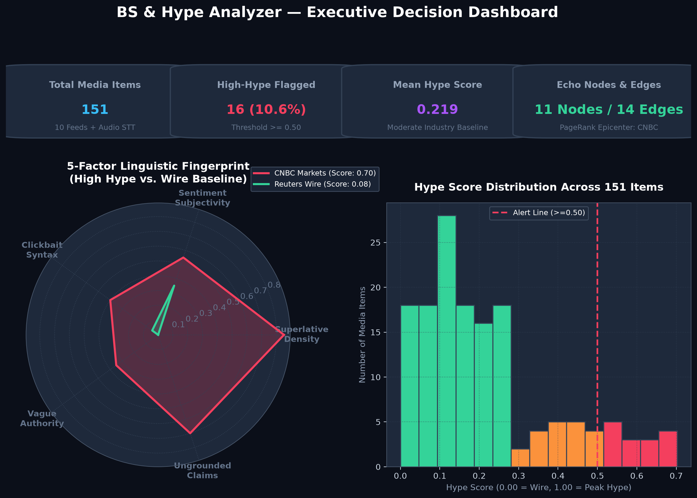
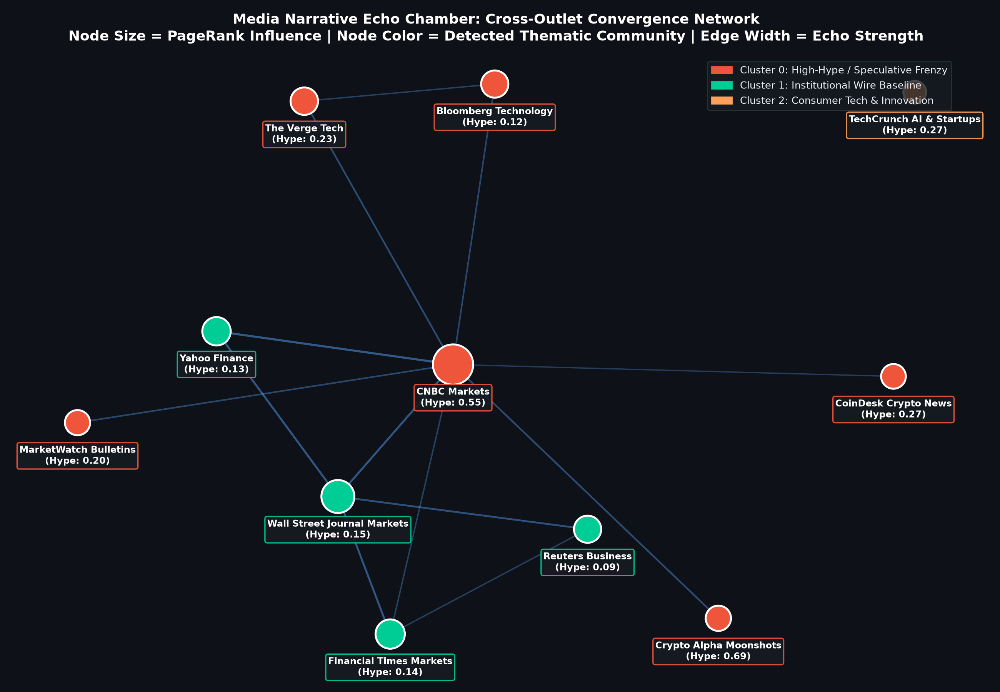
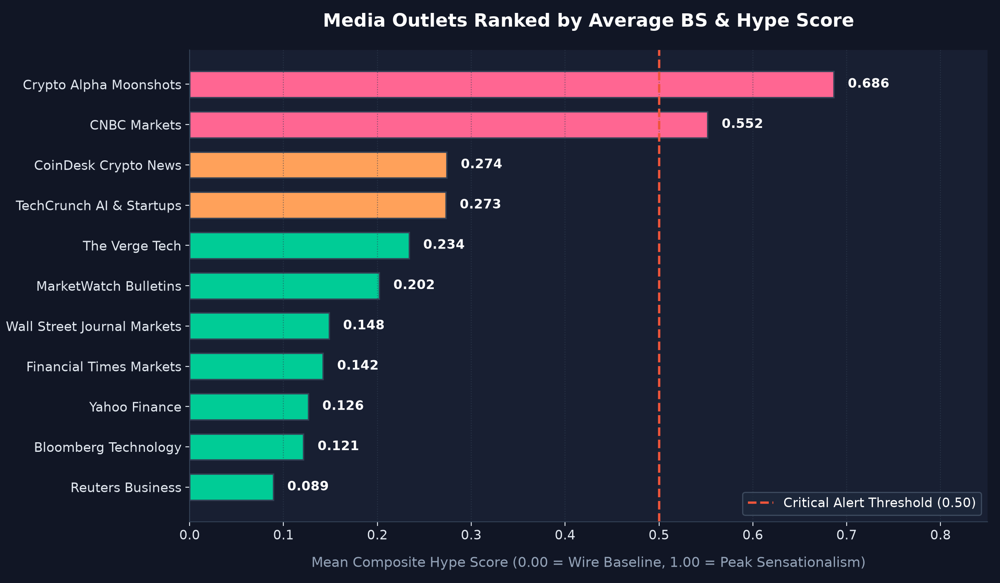
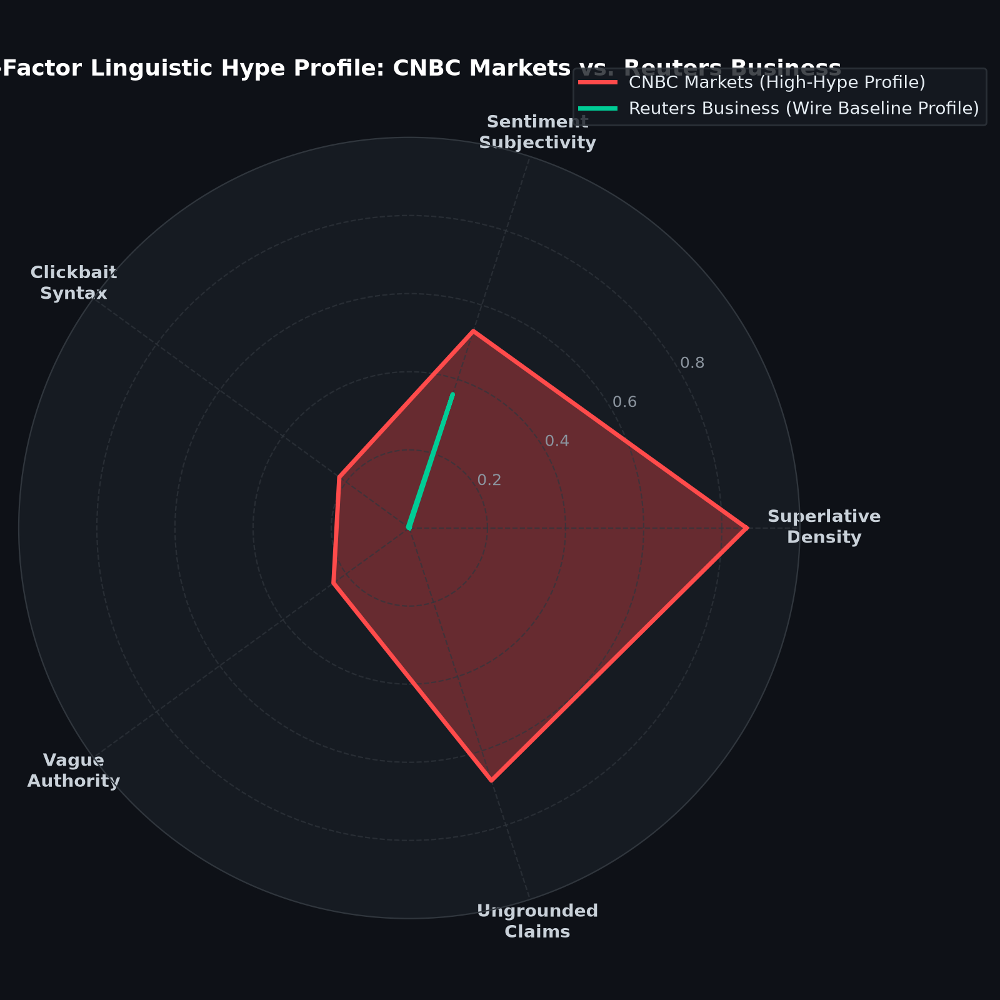
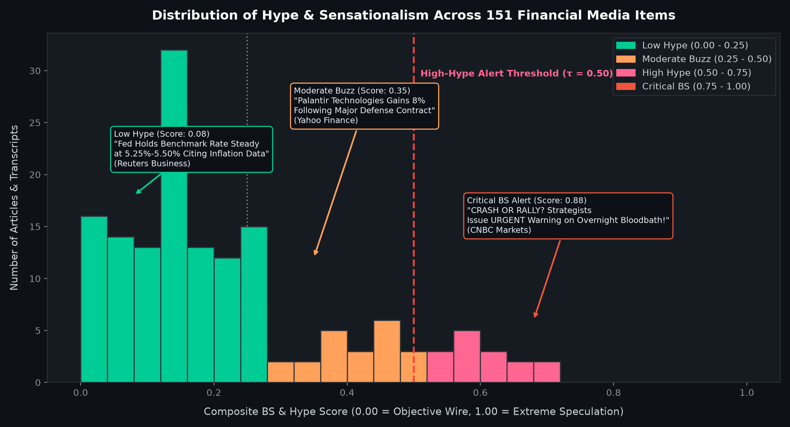

# BS & Hype Analyzer

AI-powered analyzer that quantifies media hype and maps narrative echo chambers — 100% local, privacy-preserving, reproducible in 5 minutes.

[](https://opensource.org/licenses/MIT)
[](tests/)
[](https://www.python.org/)
[](#)
[](https://nbviewer.org/github/unknown404-practice/bs-hype-analyzer/tree/master/notebooks/)

---

## 🎯 What is this?

Modern financial and technology news cycles are saturated with hyperbolic rhetoric, fear-mongering headlines, and circular citations. Retail investors, researchers, and consumers make high-stakes decisions based on media that often prioritizes sensationalism over verifiable facts. This information pollution distorts price discovery, amplifies market panics, and erodes public trust.

The **BS & Hype Analyzer** provides an objective, automated antidote. Ingesting multi-modal streams — from wire RSS feeds to financial YouTube broadcasts — it transcribes speech locally with OpenAI Whisper, extracts linguistic signals with spaCy, and calculates a rigorous **5-Factor Hype Score**. It then applies graph theory (NetworkX, PageRank, Greedy Modularity) to map cross-outlet co-amplification and expose circular echo chambers.

With this tool, you can instantly see which outlets produce the most sensationalized coverage, trace how speculative narratives propagate across the media landscape, and filter out high-hype noise.

- **100% local execution (no external APIs, no data leaks).**
- **Designed for investors, educators, and anyone who wants clearer signal in noisy media.**

---

## 🏗️ Project Architecture

The system is structured as a decoupled 4-tier pipeline where raw multi-modal media flows into quantified linguistic features, graph-theoretic clusters, and decision dashboards:



For full mathematical and pipeline details, see **[docs/architecture.md](docs/architecture.md)** and **[docs/metrics.md](docs/metrics.md)**.

---

## 🚀 Quickstart (5 minutes)

Follow these steps to run the complete pipeline with pre-cached benchmark data on Windows, macOS, or Linux:

### 1. Clone the repository
```bash
git clone https://github.com/unknown404-practice/bs-hype-analyzer.git
cd bs-hype-analyzer
```

### 2. Create and activate a virtual environment
- **Windows (PowerShell):**
  ```powershell
  python -m venv venv
  .\venv\Scripts\Activate.ps1
  ```
- **macOS / Linux:**
  ```bash
  python3 -m venv venv
  source venv/bin/activate
  ```

### 3. Install dependencies and NLP model
```bash
pip install -r requirements.txt
python -m spacy download en_core_web_sm
```

### 4. Run the automated pipeline
```bash
make all
```
*(On Windows systems without `make`, run: `python -m src.cli run-demo`)*

### 5. Launch the interactive dashboard
Open **`notebooks/04_interactive_dashboard.ipynb`** in **JupyterLab Desktop** and run all cells.

> [!NOTE]
> All sample datasets are pre-cached in `data/raw/`. The entire demo executes 100% offline with zero external API calls or network access required.

---

## 📊 Visual Gallery & What You’ll See

Below are the pre-rendered outputs generated by the pipeline across the notebooks:

### 1. Executive Decision Dashboard
Real-time KPI metrics, interactive threshold sliders, outlet filters, and linguistic diagnostic breakdowns.


### 2. Media Narrative Echo-Chamber Network
Cross-outlet co-amplification graph showing detected thematic modularity communities (Speculative Frenzy vs. Institutional Wire Baseline) and PageRank epicenters.


### 3. Media Outlets Ranked by Hype Intensity
Comparative benchmarking of 10 wire outlets and financial broadcasts against the critical alert threshold ($\tau = 0.50$).


### 4. 5-Factor Linguistic Hype Profile (Radar Diagnostics)
Linguistic radar fingerprint contrasting high-hype speculative journalism (CNBC Markets) against objective wire baseline reporting (Reuters Business).


### 5. Hype Score Distribution Spectrum
Bimodal information pollution spectrum across 151 analyzed financial and tech media items.


> [!TIP]
> **Viewing on GitHub vs. Local**:
> - **On GitHub**: Notebook cells display these high-resolution static figures automatically. You can also view interactive versions on **[nbviewer](https://nbviewer.org/github/unknown404-practice/bs-hype-analyzer/tree/master/notebooks/)**.
> - **In JupyterLab Desktop**: Run the notebooks locally to use live `ipywidgets` sliders, dropdown filters, and GPU/physics simulations in **`notebooks/04_interactive_dashboard.ipynb`** and **`notebooks/view_html_reports.ipynb`**.

---

## 🧠 How it works (at a glance)

- **5-Factor Hype Score**: Combines superlative density, sentiment subjectivity, clickbait syntax, vague authority shielding, and quantitative grounding disparity into a calibrated $0.0 \text{ to } 1.0$ score.
- **Echo-Chamber Graph**: Media outlets are linked by named entity Jaccard overlap and shared content n-grams; modularity clustering reveals narrative subcultures, while PageRank pinpoints central media epicenters.
- **Multi-Modal Ingestion**: Financial RSS feeds and YouTube influencer audio tracks are ingested and transcribed locally with Whisper STT on CPU/GPU.

---

## 📁 Project Structure

The complete repository hierarchy, directory roles, and data pipeline flow:

```mermaid
graph TD
    Root["bs-hype-analyzer/"]
    
    Root --> Config["config/"]
    Config --> C1["feeds.json (10 Curated Outlets)"]
    Config --> C2["hype_config.yaml (Scoring Weights & Thresholds)"]

    Root --> Data["data/"]
    Data --> D1["raw/ (Cached RSS Feeds & YouTube Transcripts)"]
    Data --> D2["interim/ (Normalized Articles CSV)"]
    Data --> D3["processed/ (sample_features.parquet & Graph CSVs)"]

    Root --> Src["src/"]
    Src --> S1["config.py (Typed Dataclasses)"]
    Src --> S2["ingest.py (RSS & Whisper STT)"]
    Src --> S3["features.py (5-Factor Metric Engine)"]
    Src --> S4["graph.py (NetworkX & PageRank)"]
    Src --> S5["viz.py (Plotly & PyVis Offline Engine)"]
    Src --> S6["cli.py (Click Terminal Interface)"]

    Root --> Notebooks["notebooks/"]
    Notebooks --> N1["00–04 (End-to-End Pipeline & Dashboard)"]
    Notebooks --> N2["view_html_reports.ipynb (Native 4-in-1 HTML Viewer)"]

    Root --> Reports["reports/"]
    Reports --> R1["figures/ (HTML Simulations & PNG Assets)"]
    Reports --> R2["demo_script.md (3.5-Min Video Storyboard)"]

    Root --> Tests["tests/ (22/22 Passing Pytest Suite)"]
    Root --> Docs["docs/ (architecture.md, metrics.md, structure.md)"]
    Root --> Meta["Root: Makefile, requirements.txt, LICENSE, README.md"]
```



```text
├── config/              # YAML & JSON configuration for feeds and hype hyperparameters
├── data/                # 3-tier data lifecycle: raw, interim, and processed (sample data included)
├── docs/                # Detailed documentation (architecture, metrics, structure)
├── notebooks/           # End-to-end JupyterLab workflow (00–04 + view_html_reports.ipynb)
├── reports/figures/     # Interactive HTML simulations, Plotly figures, and PNG charts
├── src/                 # Core production modules (config, ingest, features, graph, viz, cli)
└── tests/               # Pytest suite with 22 unit tests (100% passing)
```

For a complete module-by-module breakdown, see **[docs/structure.md](docs/structure.md)**.

---

## 🛠 Tech stack

- **Core & NLP**: Python 3.12, spaCy (`en_core_web_sm`), TextBlob, Transformers (PyTorch).
- **Speech & Audio**: OpenAI Whisper / faster-whisper, yt-dlp.
- **Network Science & Math**: NetworkX, NumPy, Pandas, Scipy.
- **Visualization**: PyVis (ForceAtlas2 physics), Plotly, ipywidgets.
- **Environment & Automation**: JupyterLab Desktop, pytest, Makefile, Click CLI.

---

## 📄 License

This project is licensed under the [MIT License](LICENSE).

---

## 👤 Creator & Contact

- **Creator**: **Ranadeep Saha**
- **Email**: [ranadeep2021saha@gmail.com](mailto:ranadeep2021saha@gmail.com)
- **GitHub**: [https://github.com/unknown404-practice/bs-hype-analyzer](https://github.com/unknown404-practice/bs-hype-analyzer)
- **LinkedIn**: [https://www.linkedin.com/in/ranadeep-saha-a03296404/](https://www.linkedin.com/in/ranadeep-saha-a03296404/)
- Member of **Google Developer Group**

---

## 🏆 Why this project stands out

- **Real-World Impact**: Directly addresses information pollution and sensationalism in financial media, helping users distinguish factual wire reporting from viral speculation.
- **Technical Depth**: Integrates local speech-to-text, NLP feature engineering, graph-theoretic community detection, and physics-based network simulation in a cohesive pipeline.
- **Reproducibility**: 5-minute setup with cached benchmark data, deterministic seeds, cross-platform Makefile automation, and a 22/22 passing test suite.
- **Portfolio-Ready Engineering**: Modular clean architecture, typed dataclasses, complete documentation hub, and native JupyterLab Desktop interactive reporting.
