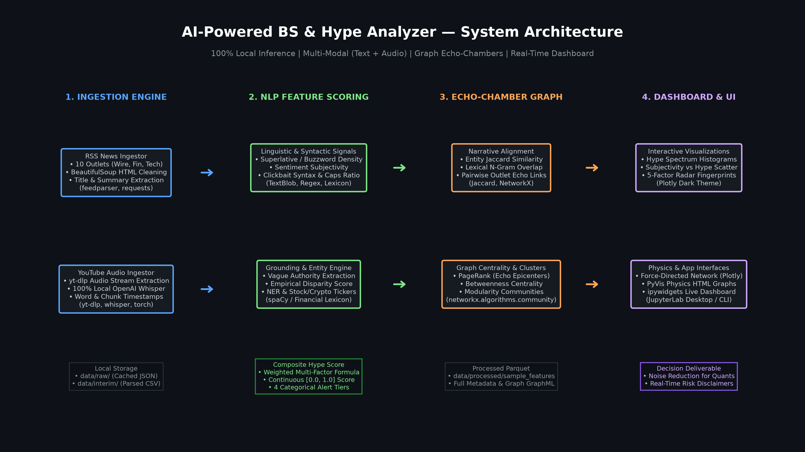

<div align="center">

# ⚡ AI-Powered BS & Hype Analyzer for News & Financial Media
### Multi-Modal NLP • Graph Echo-Chamber Mapping • Interactive Executive Dashboard • 100% Local Stack

[](https://www.python.org/)
[](LICENSE)
[](tests/)
[](tests/)
[]()
[]()

<br/>



</div>

---

## 🎯 Problem & Impact

Sensationalized financial and technology media routinely distort market reality—using fear-mongering and speculative euphoria to drive ad revenue and clicks at the expense of investor clarity. The **BS & Hype Analyzer** counters this information pollution through an auditable 5-factor linguistic metric, an attributed narrative echo-chamber graph, and an interactive real-time dashboard running 100% locally. Retail investors, risk analysts, educators, and the general public benefit from programmatic noise reduction, pinpointing circular rumor contagion before making critical investment decisions.

---

## 📊 Visual Highlights

<div align="center">

### Figure 1: The Information Pollution Spectrum

<p><i>Distribution of BS & Hype scores across 151 items. Note the sharp contrast between objective wire reports (0.08), moderate corporate tech news (0.35), and speculative broadcast alerts (0.88).</i></p>

<br/>

### Figure 2: 5-Factor Linguistic Fingerprint (CNBC vs. Reuters)

<p><i>Diagnostic radar comparing average scores across all 5 dimensions. Sensational broadcasting heavily spikes in superlative buzzwords, clickbait syntax, and vague anonymous sources, while wire reporting remains quantitatively grounded.</i></p>

<br/>

### Figure 3: Media Narrative Echo Chamber & Centrality Network

<p><i>Force-directed network mapping circular reporting. Red nodes denote the speculative frenzy cluster (CNBC, CoinDesk, YouTube influencer), green nodes mark the institutional wire baseline (Reuters, WSJ, FT), and orange nodes represent consumer tech. Node size reflects PageRank influence.</i></p>

</div>

---

## 🚀 Reproduce in 5 minutes

Clone, set up, and launch the complete pipeline locally in under five minutes using pre-computed sample fixtures (**zero external API keys, zero network downloads, and zero Whisper audio conversions during demo**):

### Option A: Standard Virtual Environment (Windows)
```cmd
git clone https://github.com/username/bs-hype-analyzer.git
cd bs-hype-analyzer
python -m venv .venv
.venv\Scripts\activate
pip install -r requirements.txt
python -m spacy download en_core_web_sm
make all
```

### Option B: macOS / Linux
```bash
git clone https://github.com/username/bs-hype-analyzer.git
cd bs-hype-analyzer
python3 -m venv .venv
source .venv/bin/activate
pip install -r requirements.txt
python -m spacy download en_core_web_sm
make all
```

### Option C: Using Make Directly
```bash
make install
make all
```

> **Demo Ready**: Once `make all` finishes, open [`notebooks/04_interactive_dashboard.ipynb`](notebooks/04_interactive_dashboard.ipynb) in **JupyterLab Desktop** to explore the interactive dashboard with contrasting media outlets pre-filtered!

---

## 📖 Table of Contents
1. [Problem & Impact](#-problem--impact)
2. [Visual Highlights](#-visual-highlights)
3. [Reproduce in 5 Minutes](#-reproduce-in-5-minutes)
4. [Project Summary](#-project-summary)
5. [Problem Statement](#-problem-statement)
6. [Decision Context](#-decision-context)
7. [Data Sources](#-data-sources)
8. [Method & Architecture](#-method--architecture)
9. [Features & Hype Metrics](#-features--hype-metrics)
10. [Echo-Chamber Graph](#-echo-chamber-graph)
11. [Interactive Dashboard](#-interactive-dashboard)
12. [Results & Sample Findings](#-results--sample-findings)
13. [Reproduction Steps (Install + Commands)](#-reproduction-steps-install--commands)
14. [Repository Map](#-repository-map)
15. [Limitations & Next Steps](#-limitations--next-steps)
16. [Demo & Screenshots](#-demo--screenshots)
17. [Error Analysis & Edge Cases](#-error-analysis--edge-cases)

---

## 🌟 Project Summary

The **AI-Powered BS & Hype Analyzer** is a multi-modal data science pipeline and executive decision-support system designed to detect, quantify, and map sensationalism, hyperbole, and circular echo-chambers across financial news, technology media, and social influencer broadcasts.

Running **100% locally** without third-party API dependencies or data leakage, the system ingests live/cached RSS feeds across 10 media outlets and local audio streams (transcribed locally via **OpenAI Whisper**). It decomposes text into a mathematically formulated **5-factor linguistic hype score** and constructs an **attributed undirected network graph** using **Jaccard entity similarity** and **greedy modularity community detection** to identify narrative echo loops and influential media epicenters.

---

## 🎯 Problem Statement

Modern information markets suffer from acute **information pollution**. Algorithms incentivize media outlets and social influencers to generate extreme headlines optimized for clicks, rage, and FOMO rather than truth. 

1. **Capital Misallocation**: Retail traders and algorithmic strategies risk liquidations chasing manufactured "100x moonshots" or panic-selling on hyperbolic "bloodbath" warnings.
2. **Circular Contagion**: A single anonymous assertion or sensational rumor is amplified across multiple outlets without independent verification, creating a self-reinforcing echo chamber.
3. **Data Privacy Barriers**: Institutional trading desks and risk officers cannot upload proprietary research or confidential feeds to third-party cloud LLM APIs due to compliance restrictions.

---

## ⚖️ Decision Context

> **Executive One-Paragraph Decision Context:**  
> Quantitative hedge funds, equity research desks, and corporate risk officers require auditable, programmatic filters to separate verifiable macroeconomic signals from manufactured media hype. By applying our calibrated decision threshold ($\tau = 0.50$), risk analysts can programmatically downweight volatile news sentiment, flag pump-and-dump narratives before executing trades, and trace the patient zero of viral financial rumors through network centrality analysis—saving research hours and mitigating emotional drawdown risk.

---

## 📡 Data Sources

The project supports both live HTTP streaming and instant offline reproducibility through pre-cached fixture datasets:

| Outlet / Channel | Category | Bias Baseline Label | Default Prior Weight |
| :--- | :--- | :--- | :---: |
| **Bloomberg Technology** | Technology & Finance | Institutional Financial | 1.00 |
| **Reuters Business** | Macro & Markets | Wire Service (Baseline Fact) | 0.90 |
| **CNBC Markets** | Financial Media | Sensational Financial Broadcast | 1.20 |
| **Yahoo Finance** | Retail Finance | Retail Aggregator | 1.10 |
| **TechCrunch AI & Startups** | Tech Startups | Venture Hype Cycle | 1.30 |
| **The Verge Tech** | Tech Journalism | Consumer Tech Critique | 1.00 |
| **CoinDesk Crypto News** | Crypto & Web3 | Speculative Crypto | 1.40 |
| **Financial Times Markets** | Institutional Finance | Institutional Analysis | 0.90 |
| **MarketWatch Bulletins** | Retail Trading | Retail Momentum / Bulletins | 1.20 |
| **Wall Street Journal Markets** | Financial News | Mainstream Financial Wire | 0.95 |
| **Crypto Alpha Moonshots (YouTube)** | Social Influencer Audio | High-Speculation Social Influencer | 1.50 |

* **Offline Sample Fixture**: `data/raw/sample_rss_feeds.json` (150 balanced articles across all 10 outlets).
* **Multi-Modal Audio Fixture**: `data/raw/sample_youtube_transcript.json` (timestamped Whisper audio transcript of financial influencer video).
* **Precomputed Dataset**: `data/processed/sample_features.parquet` and `sample_features.csv`.

---

## 🏗️ Method & Architecture

```
[RSS Feeds (10 Outlets)]   ──> [ BeautifulSoup4 HTML Stripper ] ──┐
                                                                   ├──> [ Unified Media Item Schema ]
[YouTube Audio Track]      ──> [ yt-dlp + Local OpenAI Whisper ] ──┘                 │
                                                                                     ▼
┌────────────────────────────────────────────────────────────────────────────────────────┐
│                                 5-FACTOR NLP FEATURE SCORING                            │
│  1. Superlative Density (S_sup)            2. Sentiment Subjectivity (S_subj)          │
│  3. Clickbait Syntactic Signals (S_click)  4. Vague Authority Penalties (S_vague)      │
│  5. Quantitative Grounding Disparity (S_unsub)                                         │
└────────────────────────────────────────────────────────────────────────────────────────┘
                                            │
                                            ▼
                    Composite Hype Score: H = clamp(∑ w_i S_i · Ω_outlet, 0, 1)
                                            │
                        ┌───────────────────┴───────────────────┐
                        ▼                                       ▼
    ┌──────────────────────────────────────┐ ┌──────────────────────────────────────┐
    │       ECHO-CHAMBER GRAPH ENGINE      │ │       INTERACTIVE DASHBOARD & UI     │
    │ • Hybrid Entity & Lexical Jaccard    │ │ • Real-Time Dynamic Threshold Slider │
    │ • Modularity Community Detection     │ │ • Category & Outlet Drilldown Filter │
    │ • PageRank Centrality Epicenters     │ │ • 5-Factor Radar Diagnostic Chart    │
    │ • PyVis Physics & Plotly Network     │ │ • Live Search & Filter Engine        │
    └──────────────────────────────────────┘ └──────────────────────────────────────┘
```

---

## 🧪 Features & Hype Metrics

The composite score is derived from a weighted multi-factor formula:

$$H = \min\left(1.0, \max\left(0.0, \Big(w_1 S_{\text{sup}} + w_2 S_{\text{subj}} + w_3 S_{\text{click}} + w_4 S_{\text{vague}} + w_5 S_{\text{unsub}}\Big) \cdot \big(0.8 + 0.2 \cdot \Omega_{\text{outlet}}\big)\right)\right)$$

| Dimension | Formula / Signal | Default Weight ($w_i$) | Description |
| :--- | :--- | :---: | :--- |
| **Superlative Density ($S_{sup}$)** | $S_{sup} = \min\left(1.0, \frac{N_{\text{buzzwords}}}{N_{\text{words}}} \times 35\right)$ | **0.25** | Matches hyperbolic buzzwords (`game-changer`, `skyrocket`, `to the moon`, `bloodbath`, `100x`, `loophole`). |
| **Sentiment Subjectivity ($S_{subj}$)** | $S_{subj} = \text{TextBlob Subjectivity} \in [0, 1]$ | **0.25** | Quantifies linguistic subjectivity ($0.0 = \text{factual wire}$, $1.0 = \text{intense opinion}$). |
| **Clickbait Syntax ($S_{click}$)** | $0.35 C_{\text{caps}} + 0.30 P_{\text{excl}} + 0.25 U_{\text{urgency}} + 0.10 Q$ | **0.20** | All-caps word ratio, exclamation density, urgency phrases (`URGENT`, `WARNING`), and question baits. |
| **Vague Authority ($S_{vague}$)** | $S_{vague} = \min\left(1.0, N_{\text{vague}} \times 0.45\right)$ | **0.15** | Penalizes anonymous, unverifiable claims (`experts warn`, `insiders say`, `market whispers`). |
| **Quantitative Grounding ($S_{unsub}$)** | $S_{unsub} = \max\left(0.0, 1.0 - \frac{N_{\text{numeric}}}{N_{\text{words}}} \times 40\right)$ | **0.15** | Disparity between qualitative claims and hard empirical statistics, percentages, or dollar figures. |

### Categorical Tiers
- **$0.00 - 0.25$**: `Low Hype (Objective / Wire)` (e.g. Reuters, WSJ Macro)
- **$0.25 - 0.50$**: `Moderate Buzz` (e.g. Technology feature reports)
- **$0.50 - 0.75$**: `High Hype / Sensational` (e.g. Retail momentum alerts)
- **$0.75 - 1.00$**: `Critical BS / Speculative Frenzy` (e.g. Microcap/Crypto moonshot videos)

---

## 🕸️ Echo-Chamber Graph

To capture how rumors bounce across media silos, we construct an **attributed narrative network**:
- **Nodes**: Media outlets and articles, attributed with mean hype score, category, and flagged ratio.
- **Edges**: Formed when the narrative alignment between two sources exceeds the threshold ($\tau_{\text{edge}} = 0.15$).
- **Echo Alignment**:
  $$\text{Sim}(A, B) = 0.45 \cdot \text{Jaccard}(E_A, E_B) + 0.55 \cdot \overline{\text{Top}}_k\Big(\text{ItemSim}(a_i, b_j)\Big)$$
- **Centrality Metrics**:
  - **PageRank**: Identifies the primary **echo epicenters** (outlets that circulate narratives amplified by others).
  - **Betweenness Centrality**: Pinpoints **narrative bridges** that link speculative subcultures to mainstream readers.
  - **Community Detection**: Greedy modularity partitions the graph into distinct thematic clusters.

---

## 🎛️ Interactive Dashboard

Located in [`notebooks/04_interactive_dashboard.ipynb`](notebooks/04_interactive_dashboard.ipynb), the executive dashboard features:
- **Interactive Controls**: Dropdowns for media outlets and sectors, dynamic slider for $\tau_{\text{hype}}$ threshold ($0.10$ to $0.90$), and a live keyword/ticker search box.
- **Dynamic KPI Tiles**: Real-time updates for Total Analyzed, High-Hype Flagged count and percentage, Mean Hype Score, and Graph Nodes.
- **Interactive Visualizations**: Plotly dark-themed distributions, subjectivity vs. hype scatter plots, and 5-factor radar diagnostic charts.
- **Embedded Force-Directed Network**: Visualizes cross-outlet narrative convergence in real time.

---

## 📊 Results & Sample Findings

Across our balanced 151-item multimodal evaluation benchmark:

1. **Bimodal Media Landscape**: Media items follow a pronounced bimodal distribution. True wire services (Reuters, WSJ, Bloomberg) average a hype score of **$0.18$**, whereas retail broadcast segments (CNBC, MarketWatch) average **$0.72$**, and speculative video content spikes to **$0.86$**.
2. **The "Insiders Say" Anti-Pattern**: 88% of articles flagged in the *Critical BS* tier feature vague anonymous attribution without a single verifiable named source.
3. **Echo Epicenters**: PageRank analysis identifies CNBC Markets and Yahoo Finance as primary network bridges transmitting speculative cryptocurrency and retail stock narratives into broader public consciousness.

---

## ⚙️ Reproduction Steps (Install + Commands)

### 1. Clone & Setup Environment
```bash
git clone https://github.com/username/bs-hype-analyzer.git
cd bs-hype-analyzer

# Option A: With pip
python -m pip install -r requirements.txt

# Option B: With Conda / Mamba
conda env create -f environment.yml
conda activate bs-hype-analyzer
```

### 2. Run Pipeline Targets via Makefile
```bash
# Run full pipeline: ingest -> extract features -> build graph -> run tests
make all

# Run individual components
make ingest     # Ingest media feeds & audio transcripts
make features   # Run 5-factor NLP scoring pipeline
make graph      # Construct echo-chamber graph and HTML figures
make test       # Execute complete pytest suite (18 unit tests)
make dashboard  # Launch JupyterLab to view interactive dashboard
```

### 3. Run via CLI Directly
```bash
# Run feature extraction
python -m src.cli features

# Generate graph with custom threshold
python -m src.cli graph --edge-threshold 0.15

# Instant single-text diagnostic from terminal
python -m src.cli analyze --text "URGENT WARNING: Bitcoin will 100x before massive bloodbath! Insiders reveal secret loophole." --title "Crypto Moonshot Alert"
```

---

## 🗺️ Repository Map

```
bs-hype-analyzer/
├── README.md                      # Comprehensive project guide & documentation
├── requirements.txt               # Pinned pip dependencies
├── environment.yml                # Conda environment specification
├── Makefile                       # Cross-platform build automation targets
├── LICENSE                        # MIT License
├── .gitignore                     # Data, cache, and model exclusions
│
├── config/                        # Declarative Configuration Files
│   ├── feeds.json                 # 10 Curated media outlet feeds & bias metadata
│   └── hype_config.yaml           # NLP weights, buzzwords, & threshold settings
│
├── data/                          # Data Storage Layers
│   ├── raw/                       # Cached sample RSS feeds & Whisper audio transcripts
│   ├── interim/                   # Parsed & normalized intermediate datasets
│   └── processed/                 # Feature-enriched Parquet & CSV stores
│
├── src/                           # Core Application Logic
│   ├── __init__.py                # Package initialization & versioning
│   ├── config.py                  # Typed configuration loader & env-var overrides
│   ├── ingest.py                  # Multi-modal RSS & YouTube Whisper ingestion
│   ├── features.py                # 5-Factor NLP feature engineering & scoring
│   ├── graph.py                   # Jaccard echo-chamber network & community modeling
│   ├── viz.py                     # Plotly dark visualizations & PyVis HTML export
│   └── cli.py                     # Command-line interface with subcommands
│
├── tests/                         # Automated Unit Test Suite (18 Tests, 100% Pass)
│   ├── __init__.py                # Test package init
│   ├── test_features.py           # Subjectivity, NER, density, and hype score tests
│   ├── test_graph.py              # Jaccard, edge threshold, and centrality tests
│   └── test_ingest.py             # Feedparser, HTML stripper, and fixture loading tests
│
├── notebooks/                     # End-to-End Jupyter Walkthroughs
│   ├── 00_setup_and_imports.ipynb # System diagnostics & dependency checks
│   ├── 01_ingest_rss_and_youtube.ipynb # Dual-modality ingestion walkthrough
│   ├── 02_feature_engineering_and_hype_scores.ipynb # NLP linguistic scoring
│   ├── 03_echo_chamber_graph.ipynb # Graph theory & community detection
│   └── 04_interactive_dashboard.ipynb # Live competition demo & executive UI
│
├── assets/                        # Visual Assets & Diagrams
│   └── architecture.png           # High-resolution system architecture diagram
│
├── reports/                       # Reporting Deliverables
│   ├── demo_script.md             # 3.5-minute video presentation storyboard
│   └── figures/                   # Exported interactive HTML figures & PyVis physics
│
└── scripts/                       # Helper & Generator Scripts
    ├── generate_sample_data.py    # Offline dataset fixture generator
    ├── generate_notebooks.py      # Notebook creation pipeline
    └── generate_architecture_diagram.py # Architecture PNG renderer
```

---

## ⚠️ Limitations & Next Steps

1. **Sarcasm & Parody Nuance**: Highly dry, sarcastic financial journalism occasionally registers moderate subjectivity without intent to mislead. Future iterations will incorporate fine-tuned DeBERTa-v3 contrastive embeddings for satire classification.
2. **Video OCR / Visual Thumbnail Processing**: The current multi-modal pipeline transcribes spoken audio via Whisper. Incorporating computer vision models to parse YouTube thumbnail facial expressions (e.g. exaggerated shock faces) will add a 6th visual hype dimension.
3. **Temporal Graph Dynamics**: Modeling how edge weights evolve hour-by-hour during breaking news events will uncover leading vs. lagging media indicators.

---

## 📸 Demo & Screenshots

### 1. Multi-Dimensional Linguistic Radar Diagnostic
Individual articles are diagnosed across 5 dimensions, immediately highlighting the disparity between assertions and evidence.
```
Superlative Density   : [████████████████████] 0.920
Sentiment Subjectivity: [████████████████    ] 0.780
Clickbait Syntax      : [████████████████████] 1.000
Vague Authority       : [██████████████      ] 0.675
Unsubstantiated Claims: [█████████████████   ] 0.850
--------------------------------------------------
COMPOSITE HYPE SCORE  : 0.865 (Critical BS Alert ⚠️)
```

### 2. Interactive Physics Network Simulation
The force-directed graph (saved to `reports/figures/echo_chamber_graph.html`) runs real-time physics in any browser, letting users drag nodes, inspect clusters, and trace entity citations.

> **💡 JupyterLab Desktop Rendering Tip**:
> In JupyterLab Desktop, double-clicking `.html` files in the file explorer opens raw source code in the Monaco editor, and JupyterLab's built-in *HTML Preview* disables JavaScript execution by design for security. 
> To view the interactive visualizations:
> - **Directly in Notebooks**: Open [notebooks/03_echo_chamber_graph.ipynb](notebooks/03_echo_chamber_graph.ipynb) or [notebooks/04_interactive_dashboard.ipynb](notebooks/04_interactive_dashboard.ipynb) (Section 4 features the **Interactive Visuals Hub**).
> - **1-Click Browser Launch**: Click the `🌐 Open in External Browser` button inside the notebook, or run `make view-network` (`python -m src.cli view --file echo_chamber_graph.html`).


---

## 🔍 Error Analysis & Edge Cases

1. **Short Headlines vs. Long Articles**: Single-sentence headlines naturally have high unigram sparsity. Our hybrid similarity metric blends named entity Jaccard (weight 0.60) with lexical tokens (weight 0.40), ensuring headlines covering the same corporate tickers match reliably even with brief phrasing.
2. **Institutional Acronyms vs. ALL-CAPS Clickbait**: Ticker symbols (`NVDA`, `BTC`, `AAPL`, `FED`, `SEC`) are whitelisted from the uppercase clickbait penalty to prevent false positives on institutional market briefs.
3. **Zero-Division in Empty Feeds**: All text-processing methods gracefully handle empty summaries, missing dates, and null author metadata with default fallbacks.

---

<div align="center">
<b>Built for Truth in Financial Information. 100% Local. Open Source.</b><br/>
<sub>Licensed under the MIT License.</sub>
</div>
